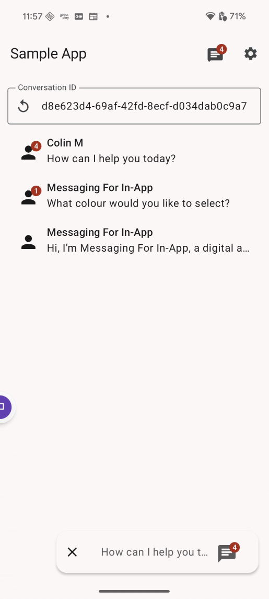

## Enhanced Chat Samples

### Sample usage of the Enhanced Chat Core and UI SDKs.

#### Core Feature Samples
 - [Hidden Pre-Chat](sample-messaging/src/main/java/com/salesforce/android/smi/messaging/features/core/HiddenPreChat.kt) - Automatically send pre-chat values without prompting the user.
 - [Templated URL](sample-messaging/src/main/java/com/salesforce/android/smi/messaging/features/core/TemplatedUrlValues.kt) - Assemble templated URLs at runtime.
 - [User Verification](sample-messaging/src/main/java/com/salesforce/android/smi/messaging/features/core/UserVerification.kt) - Verify users before allowing them to access conversations.
 - [Salesforce Authentication](sample-messaging/src/main/java/com/salesforce/android/smi/messaging/features/core/salesforceAuthentication) - Verify users using Salesforce authentication.

#### UI Feature Samples
 - [Populate Pre-Chat](sample-messaging/src/main/java/com/salesforce/android/smi/messaging/features/ui/PopulatePreChat.kt) - Populate pre-chat fields with a default value.
 - [UI Replacement](sample-messaging/src/main/java/com/salesforce/android/smi/messaging/features/ui/replacement) - Conditionally replace or hide components of the out-of-the-box UI.

#### Sample Components

 - [Icon](sample-messaging/src/main/java/com/salesforce/android/smi/messaging/samples/components/MessagingIcon.kt) - Icon for displaying the unread count.
 - [Button](sample-messaging/src/main/java/com/salesforce/android/smi/messaging/samples/components/MessagingButton.kt) - General purpose icon button that launches chat and displays the unread count.
 - [Widget](sample-messaging/src/main/java/com/salesforce/android/smi/messaging/samples/components/MessagingWidget.kt) - A floating action button that launches/ends the chat and updates based on the session status, last message, queue position, and unread count.
 - [ConversationList](sample-messaging/src/main/java/com/salesforce/android/smi/messaging/samples/components/MessagingConversationList.kt) - Lists the user's conversations with the latest message and an unread counter.
 - [Modal](sample-messaging/src/main/java/com/salesforce/android/smi/messaging/samples/components/MessagingBottomSheet.kt) - A dismissable bottom sheet modal container for the messaging UI.

#### Sample Utilities
 - [LifecycleResumeMessagingStreamEffect](sample-messaging/src/main/java/com/salesforce/android/smi/messaging/samples/state/LifecycleResumeMessagingStreamEffect.kt) - Maintains the messaging event stream when the UI is closed. Used for receiving conversation updates.
 - [MessagingSessionState](sample-messaging/src/main/java/com/salesforce/android/smi/messaging/samples/state/MessagingSessionState.kt) - Maintains an object with the relevant data used in the sample components. This could also be done in your ViewModel instead.

#### Sample Usage
 - [MainActivity](sample-app/src/main/java/com/salesforce/android/smi/sampleapp/MainActivity.kt)
 - [SalesforceMessaging](sample-messaging/src/main/java/com/salesforce/android/smi/messaging/SalesforceMessaging.kt)

#### Demo

